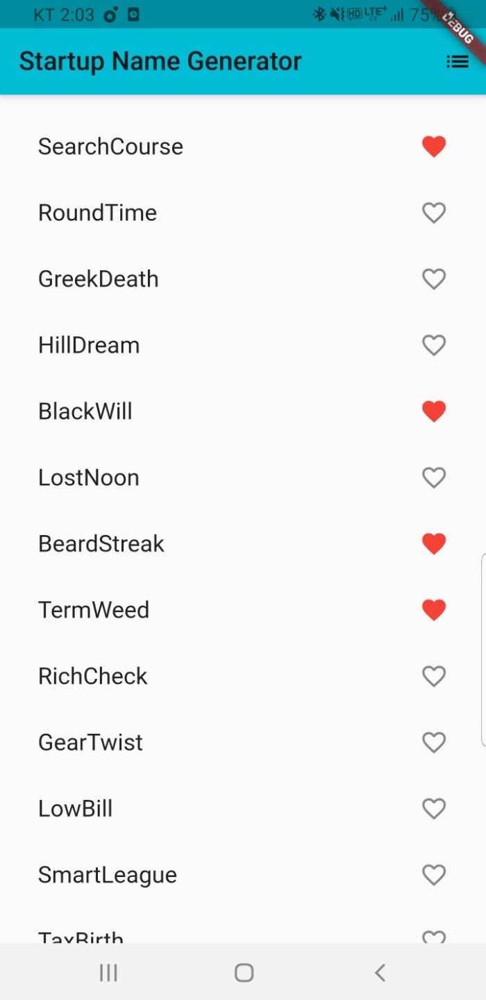
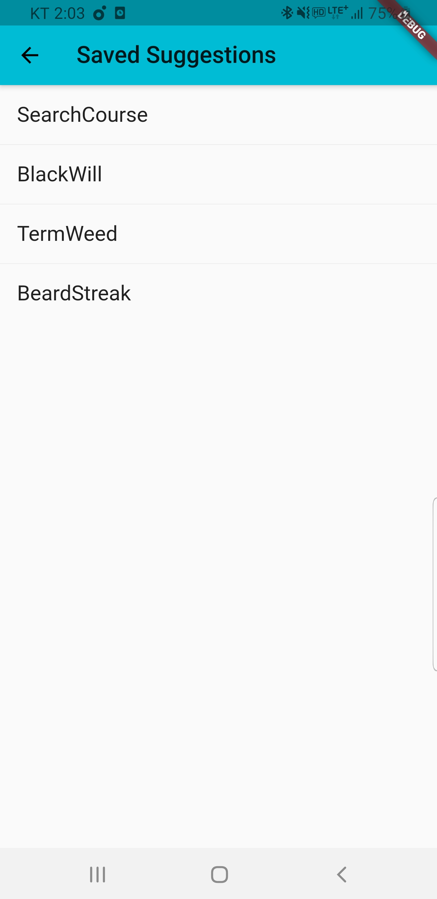

# first_flutter_app 플러터 애플리케이션

A new Flutter application.

## Example of execution  실행 예시

리스트를 보여주고 하트 체크가 된 리스트의 경우 Liked Suggestions에 값을 넘겨 보여준다.

## Getting Started

This project is a starting point for a Flutter application.

A few resources to get you started if this is your first Flutter project:

- [Lab: Write your first Flutter app](https://flutter.dev/docs/get-started/codelab)
- [Cookbook: Useful Flutter samples](https://flutter.dev/docs/cookbook)

For help getting started with Flutter, view our
[online documentation](https://flutter.dev/docs), which offers tutorials,
samples, guidance on mobile development, and a full API reference.
